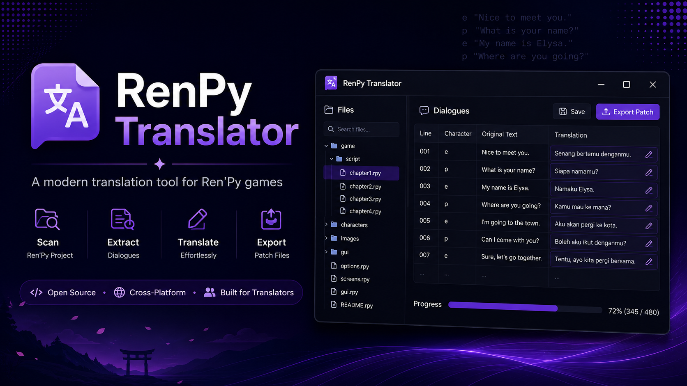

<p align="center">
  
</p>

<h1 align="center">RenPy Translator</h1>

<p align="center">
  <strong>A modern open-source desktop application for translating Ren'Py visual novel projects.</strong>
</p>

<p align="center">
Translate faster. stay organized. Export with confidence.
</p>

<p align="center">


</p>

---

#✨ About

RenPy Translator is a desktop application designed to simplify the process of translating **Ren'Py visual novels**.

Instead of manually editing `.rpy` files, translators can manage dialogues through a clean and modern interface, making the localization workflow faster, safer, and more organized.

---

# 🚀 Features

## Current

- Scan Ren'Py projects
- Parse dialogue files
- Extract translatable text
- Project-based translation workflow
- Modern desktop interface
- Open-source

---

## Planned

- Dialogue editor
- Inline translation editing
- Translation progress tracking
- Export translation patches
- Multi-language support
- Auto-save project
- Search & Filter
- Theme support

---

# 🖥 Preview

> Screenshots will be added as development progresses.

---

# 📂 Project Structure

```text
RenPy-Translator/

├── assets/
├── core/
├── docs/
├── tests/
├── ui/
├── ui_mobile/
├── README.md
├── CHANGELOG.md
├── ROADMAP.md
└── LICENSE
```

---

# ⚡ Installation

Clone the repository

```bash
git clone https://github.com/systemzerodev/RenPy-Translator.git
```

Go into the project

```bash
cd RenPy-Translator
```

Create a virtual environment

```bash
python -m venv venv
```

Activate it

Windows

```bash
venv\Scripts\activate
```

Linux / macOS

```bash
source venv/bin/activate
```

Install dependencies

```bash
pip install -r requirements.txt
```

Run the application

```bash
python main.py
```

---

# 🛣 Roadmap

Current development focuses on:

- Stable core architecture
- Modern desktop UI
- Translation workflow
- Patch exporting
- Better user experience

See the complete roadmap in:

```
ROADMAP.md
```

---

# 🤝 Contributing

Contributions are welcome.

Please read:

- CONTRIBUTING.md
- CODE_OF_CONDUCT.md

before opening a Pull Request.

---

# 📜 License

This project is licensed under the MIT License.

See the LICENSE file for more information.

---

# ❤️ Acknowledgements

Special thanks to:

- The Ren'Py community
- Open-source contributors
- Everyone helping improve visual novel localization

---

<p align="center">

Made with ❤️ for the Ren'Py Community.

</p>
